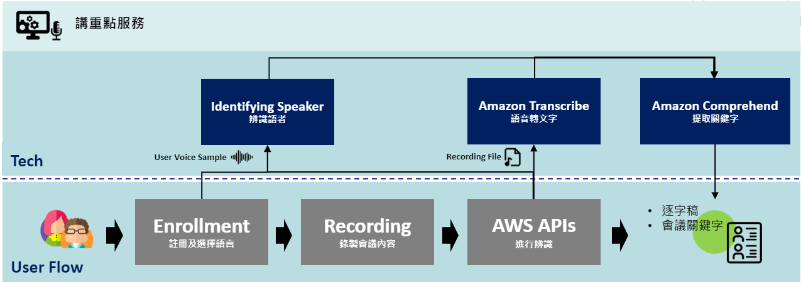
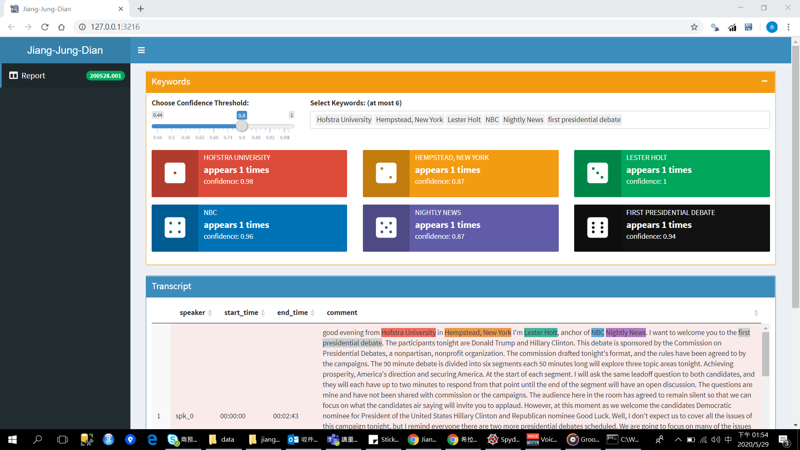

# Jiang-Jung-Dian (講重點) 
It offers users a  convenience way to convert recording audios to transcript with identified speakers. 
The converting part is done by utilizing Amazon Transcribe and Amazon Comprehend, while the identifying part is achieved by utilizing  [VGGVox](https://github.com/linhdvu14/vggvox-speaker-identification) speaker identification model.
Here is the [link](https://drive.google.com/file/d/1whhz6bFP_wMR-ODrjzV7BuTntO5tLLCG/view) of a simple deom vedio for AWS hackathon.
It is demonstrated by using 2016 America presidential debate on [youtobe](https://www.youtube.com/watch?v=3M1QBzdpu4Y).

# Prerequisites
- Python >= 3.7
- R >= 3.6.1

# Setup
- `$ pip install -r requirements.txt` to install all dependencies wirtten in python. 
- To install all dependencies wirtten in R: 
    - `$ install.packages("data.table")`
    - `$ install.packages("dplyr")`
    - `$ install.packages("shiny")`
    - `$ install.packages("DT")`
    - `$ install.packages("shinydashboard")`
    - `$ install.packages("stringr")`

# Execute
1. First, run `$ python ui.py`, a GUI will pop up. \

     
     
2. Then do enrollment:
    - Enter "speaker's name" in `使用者名稱`
    - Click `開始錄音` to start enroll the speaker's voice.
    - Click `結束錄音` if one finishes recording. 
    - Iterate over the first three processes if there are multiple speakers. 
    - After all speakers are enrolled, click `開始辨識`. 
3. Third, start recoding by clicking `會議錄音`, and finish recording by clicking `結束會議`.  
4. The result can be seen by cicking the generated `shiny.bat` file. 

# Processes behind the scene

# Result

# Contributors
- Ray Yu (yuchio8156@gmail.com)
- Ling Tseng (lynn4261@gmail.com)
- Vincent Lai (watlz1533@gmail.com)
- Peiyu Ho (peiyu_ho@wistron.com)
- Gigi Yeh (gigi2jean@gmail.com)
- Hank Shih(leo21274@hotmail.com)

# Acknowledgments
Thanks [Hack For Good](https://awstaiwanhackathon2020.splashthat.com/) hold by AWS for providing the AWS Services, and the open source of VGGVox. 
Special thanks to Chen, Stuart, the Solutions Architect at Amazon Web Services (AWS), for technical supports.  
